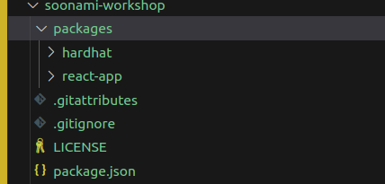
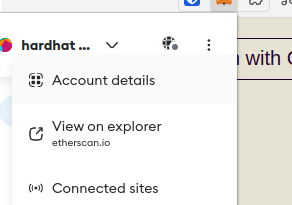
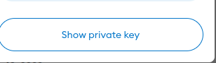

# kickstart your hackathon project with celo composer

<!-- GETTING STARTED -->

## Prerequisites

- Node
- Git (v2.38 or higher)
- Metamask wallet installed 

## How to use Celo Composer

The easiest way to start with Celo Composer is using `@celo/celo-composer`. This CLI tool lets you quickly start building dApps on Celo for multiple frameworks, including React (with either react-celo or rainbowkit-celo), React Native (w/o Expo), Flutter, and Angular. To get started, just run the following command, and follow the steps:

```bash
npx @celo/celo-composer@latest create
```

### Front-end framework


### Web3 library (for react-app)


### Smart contract framework


### Subgraph


### Name your dApp


**_🔥Voila, you have a dApp ready to go. Voila, you have a dApp ready to go. Start building your dApp on Celo._**



## Built With

Celo Composer is built on Celo to make it simple to build dApps using a variety of front-end frameworks, and libraries.

- [Celo](https://celo.org/)
- [Solidity](https://docs.soliditylang.org/en/v0.8.19/)
- [Next.js](https://nextjs.org/)
- [React.js](https://reactjs.org/)
- [Material UI](https://mui.com/)
- [React Native](https://reactnative.dev/)
- [Flutter](https://docs.flutter.dev/)
- [React-celo](https://github.com/celo-org/react-celo/)
- [Rainbowkit-celo](https://github.com/celo-org/rainbowkit-celo)

<p align="right">(<a href="#top">back to top</a>)</p>

# Explore your project

 - your project directory should look like this
   - packages
     - hardhat
     -  react-app
  -  package.json
  -  readme.md

 Navigate to your project  directory and run the following commands to install the dependencies: 
```bash
npm install
```
or 
```bash
yarn install
```

## Prepare your Smart contracts  [hardhat folder]

### What do you have in your smart contract directory?
- `contracts` directory contains the smart contracts out of the box that you can use to build your dApp.
  - ERC20.sol
  - ERC721.sol
  - ERC1155.sol
  - Greeter.sol
  - Storage.sol
- `deploy` directory contains the deployment scripts for your smart contracts.
  - 00-greeter.js
  - 01-storage.js
  - 02-erc20.js
  - 03-erc721.js
  - 04-erc1155.js
- `scripts` directory contains the scripts to deploy your smart contracts to blockchain.
  - sample-script.js
  - watch.js
- `test` directory contains the tests for your smart contracts.
- `hardhat.config.js` is the configuration file for your smart contract project.
- `package.json` is the package file for your smart contract project.

### Steps to deploy your smart contract to blockchain, Celo Alfajores testnet in this case.
#### Before shipping your smart contract to testnet or mainnet, you need to do the following:
-  Create a `.env` file in the root directory of your project. Add the following environment-specific variables on new lines in the form of NAME=VALUE:
```
PRIVATE_KEY=YOUR_PRIVATE_KEY
# optional
CELOSCAN_API_KEY=YOUR_CELOSCAN_API_KEY
MNEMONIC=YOUR_MNEMONIC
```

  - How to get you private key?
    - There are many ways to get your account private key :
    - From wallet e.g Metamask 
         
           

      - From hardhat : run the following command
        ```bash
        npm run hardhat:create-account
        ```
    
        

  - Deploy your contracts locally 
    - Start your local node: Run the following command in separated terminal to start your local node.
    ```bash
    npm run hardhat:devchain
    ```
  - Compile and deploy your contract:
    - you can add this command to the package.json script or run the following command in your terminal to compile and deploy your contract to local node.
    ```bash 
    #navigate to packages/hardhat directory
    npx hardhat deploy --network hardhat 
    ```
- Testing : run the following command in your terminal to test your smart contract.
  ```bash
  npm run hardhat:test-local
  ```
  **Note: Remove `oracle-test.js`** file. no oracle contract to test.

  #### Start shipping your contracts to Celo Alfajores testnet 
- Fund your wallet to be able to send transactions on Celo Alfajores testnet. You can get free testnet tokens from [Celo Faucet](https://faucet.celo.org/alfajores).
  - Copy your wallet address from Metamask and paste it in the Celo Faucet. Or run the following command in your terminal to get your wallet address.  
   ```bash
  npm run hardhat:accounts
  #or
  yarn run hardhat:accounts 

  ```
    - Without funding your wallet, you will get the following error when you try to deploy your smart contract to blockchain.
    ```bash
        Error: insufficient funds for intrinsic transaction cost
        ```

- Testing : run the following command in your terminal to test your smart contract.
  ```bash
  npm run hardhat:test
  ```
- Compile and deploy your contract: Run the following command in your terminal to compile and deploy your contract to local node.
    ```bash 
    npm run hardhat:deploy
    ```


## Prepare your Front end [react-app folder]


