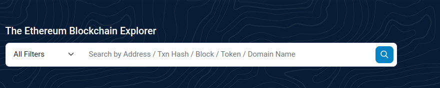

# kickstart your hackathon project with celo composer

<!-- GETTING STARTED -->

## Prerequisites

- Node
- Git (v2.38 or higher)
- Metamask wallet installed 

## How to use Celo Composer

The easiest way to start with Celo Composer is using `@celo/celo-composer`. This CLI tool lets you quickly start building dApps on Celo for multiple frameworks, including React (with either react-celo or rainbowkit-celo), React Native (w/o Expo), Flutter, and Angular. To get started, just run the following command, and follow the steps:

```bash
npx @celo/celo-composer@latest create
```

### Front-end framework


### Web3 library (for react-app)


### Smart contract framework


### Subgraph


### Name your dApp


**_🔥Voila, you have a dApp ready to go. Voila, you have a dApp ready to go. Start building your dApp on Celo._**



## Built With

Celo Composer is built on Celo to make it simple to build dApps using a variety of front-end frameworks, and libraries.

- [Celo](https://celo.org/)
- [Solidity](https://docs.soliditylang.org/en/v0.8.19/)
- [Next.js](https://nextjs.org/)
- [React.js](https://reactjs.org/)
- [Material UI](https://mui.com/)
- [React Native](https://reactnative.dev/)
- [Flutter](https://docs.flutter.dev/)
- [React-celo](https://github.com/celo-org/react-celo/)
- [Rainbowkit-celo](https://github.com/celo-org/rainbowkit-celo)

<p align="right">(<a href="#top">back to top</a>)</p>

# Explore your project

 - your project directory should look like this
   - packages
     - hardhat
     -  react-app
  -  package.json
  -  readme.md

 Navigate to your project  directory and run the following commands to install the dependencies: 
```bash
npm install
```
or 
```bash
yarn install
```

## Prepare your Smart contracts  [hardhat folder]

### What do you have in your smart contract directory?
- `contracts` directory contains the smart contracts out of the box that you can use to build your dApp.
  - ERC20.sol
  - ERC721.sol
  - ERC1155.sol
  - Greeter.sol
  - Storage.sol
- `deploy` directory contains the deployment scripts for your smart contracts.
  - 00-greeter.js
  - 01-storage.js
  - 02-erc20.js
  - 03-erc721.js
  - 04-erc1155.js
- `scripts` directory contains the scripts to deploy your smart contracts to blockchain.
  - sample-script.js
  - watch.js
- `test` directory contains the tests for your smart contracts.
- `hardhat.config.js` is the configuration file for your smart contract project.
- `package.json` is the package file for your smart contract project.

### Steps to deploy your smart contract to blockchain, Celo Alfajores testnet in this case.
#### Before shipping your smart contract to testnet or mainnet, you need to do the following:
-  Create a `.env` file in the root directory of your project. Add the following environment-specific variables on new lines in the form of NAME=VALUE:
```
PRIVATE_KEY=YOUR_PRIVATE_KEY
# optional
CELOSCAN_API_KEY=YOUR_CELOSCAN_API_KEY
MNEMONIC=YOUR_MNEMONIC
```

  - How to get you private key?
    - There are many ways to get your account private key :
    - From wallet e.g Metamask 
         
           

         **Note:** : you will enter your wallet password to get the private key.

    - From hardhat : run the following command
        ```bash
        npm run hardhat:create-account
        ```
    
        

  - Deploy your contracts locally 
    - Start your local node: Run the following command in separated terminal to start your local node.
    ```bash
    npm run hardhat:devchain
    ```
  - Compile and deploy your contract:
    - you can add this command to the package.json script or run the following command in your terminal to compile and deploy your contract to local node.
    ```bash 
    #navigate to packages/hardhat directory
    npx hardhat deploy --network hardhat 
    ```
- Testing : run the following command in your terminal to test your smart contract.
  ```bash
  npm run hardhat:test-local
  ```
  **Note: Remove `oracle-test.js`** file. no oracle contract to test.

  #### Start shipping your contracts to Celo Alfajores testnet 
- Fund your wallet to be able to send transactions on Celo Alfajores testnet. You can get free testnet tokens from [Celo Faucet](https://faucet.celo.org/alfajores).
  - Copy your wallet address from Metamask and paste it in the Celo Faucet. Or run the following command in your terminal to get your wallet address.  
   ```bash
  npm run hardhat:accounts
  #or
  yarn run hardhat:accounts 

  ```
    - Without funding your wallet, you will get the following error when you try to deploy your smart contract to blockchain.
    ```bash
        Error: insufficient funds for intrinsic transaction cost
        ```

- Testing : run the following command in your terminal to test your smart contract.
  ```bash
  npm run hardhat:test
  ```
- Compile and deploy your contract: Run the following command in your terminal to compile and deploy your contract to local node.
    ```bash 
    npm run hardhat:deploy
    ```


## Prepare your Front end [react-app folder]


### What do you have in your react-app directory?
- components : where you can find your page components
  - Footer.tsx
  -  Header.tsx
  -  Layout.tsx
- pages
  - index.tsx
  - _app.tsx
  - api
    - hello.ts
- public : all your static files e.g styles, images, fonts, etc. you can add, remove or change.
  - favicon.ico
  - logo.svg
  - styles
- tailwind.config.js : here you can change how your app looks like by changing the theme colors.


## run your app locally
- First , Wallet-connect requires getting `projectId` 
  - Create `.env` file 
  - add projectId  : With the newest update, every dApp that relies on WalletConnect now needs to obtain a projectId from [WalletConnect Cloud](https://cloud.walletconnect.com/sign-in). This is absolutely free and only takes a few minutes.
   ```
   NEXT_PUBLIC_WC_PROJECT_ID=YOUR_PROJECT_ID
    ```
- Run your app locally :
```bash
yarn run react-app:dev
```

## Out of the box  Web3 related code 
Your app already have the main web3 configuration that you need to start with :
- In `_app.tsx` file has all the required configuration to let your app connect to celo network and manage your wallet. 
  - In the selected framework we are using `Wagmi` aand `RainbowKitProvider` and the configuration is passed though  React Context. If you select a different framework you will get different configuration.
  ```typescript
      <WagmiConfig config={wagmiConfig}>
      <RainbowKitProvider chains={chains} appInfo={appInfo} coolMode={true}>
      // your react components goes here.
        <Layout>
          <Component {...pageProps} />
        </Layout>
      </RainbowKitProvider>
    </WagmiConfig>
  
   ```
  **wagmi** is a collection of React Hooks containing everything you need to start working with Ethereum. wagmi makes it easy to "Connect Wallet," display ENS and balance information, sign messages, interact with contracts, and much more — all with caching, request deduplication, and persistence.
- In `index.tsx` file you can find the code to connect your wallet and get the current user address.
  ```typescript


     import { useAccount } from "wagmi";
    const { address, isConnected } = useAccount();

  useEffect(() => {
    if (isConnected && address) {
      setUserAddress(address);
    }
  }, [address, isConnected]);
  ```

  - In `components/Header.tsx` file you can find the code to connect your wallet and get the current user address.
  ```typescript
  import { ConnectButton } from "@rainbow-me/rainbowkit";
  // wallet button
    {!hideConnectBtn && (
                  <ConnectButton
                    showBalance={{ smallScreen: true, largeScreen: false }}
                  />
                )}
  ```
  
## Integrate your smart contract with your front end. Using `Greeter` contract as an example
### important info before we start:
Regardless of the web3 package you are using to connect your Dapp to blockchain. Any web3 package needs to know 3 things to interact with a smart contract:
1. Which end point to connect to ? `your network rpc endpoint`.
2. Which contract to interact with ? `your contract address`.
3. Which function to call? `your contract ABI` that has all contract functions and events.
Also: 
- Any call to read from blockchain is free.
- Any call to write to blockchain will cost you gas fee and blockchain needs to know who is sending the transaction. `from` your wallet address.
### Get contract ABI and address
- Copy the `Greeter.json` that has contract ABI and address from `packages/hardhat/deployments/alfajores/` Directory.
- Create `contracts` directory in your `react-app` directory.
- Paste the `Greeter.json` file in the `contracts` directory.
- Import the `Greeter.json` file in your react component.
```typescript
import Greeter from "../contracts/Greeter.json";

 const contractAbi = Greeter.abi;
  const contractAddress = Greeter.address;
```

- To call function that writes to blockchain `sending transaction`
  - we will import `usePrepareContractWrite ,useContractWrite` from `wagmi` package.
   
    ```typescript
    
    const { config } = usePrepareContractWrite({
    address: contractAddress as `0x${string}`,
    abi:contractAbi,
    functionName: 'setGreeting',
    args: [greeting],
    })
    const { write } = useContractWrite(config)
    ```

- To call function that reads from blockchain `function call`:
  - we will import `useContractRead` from `wagmi` package.
    ```typescript
    const {data} = useContractRead({
       address: contractAddress as `0x${string}`,
    abi:contractAbi,
        functionName:"greet",
        watch: true
    })
    
    ```


## interacting with the Dapp 
- make sure you added the network that your contract operates on. 
  - To add it , the easies way is through https://chainlist.org/ 
  - If you didn't find the network you are looking for, you can add it manually.
    - open your wallet and click on setting.
    - Click on `Networks`
    - Click on `Add a network manually`
    - Add the network name and rpc endpoint.
    - Add the chain id.
    - Add the currency symbol.
    - Add the block explorer url.
    - Click on `save` button.


## for alfajores testnet, you can click on `Add Celo Testnet `  in this [link](https://faucet.celo.org/alfajores) and approve adding the network when metamask popup shows up.